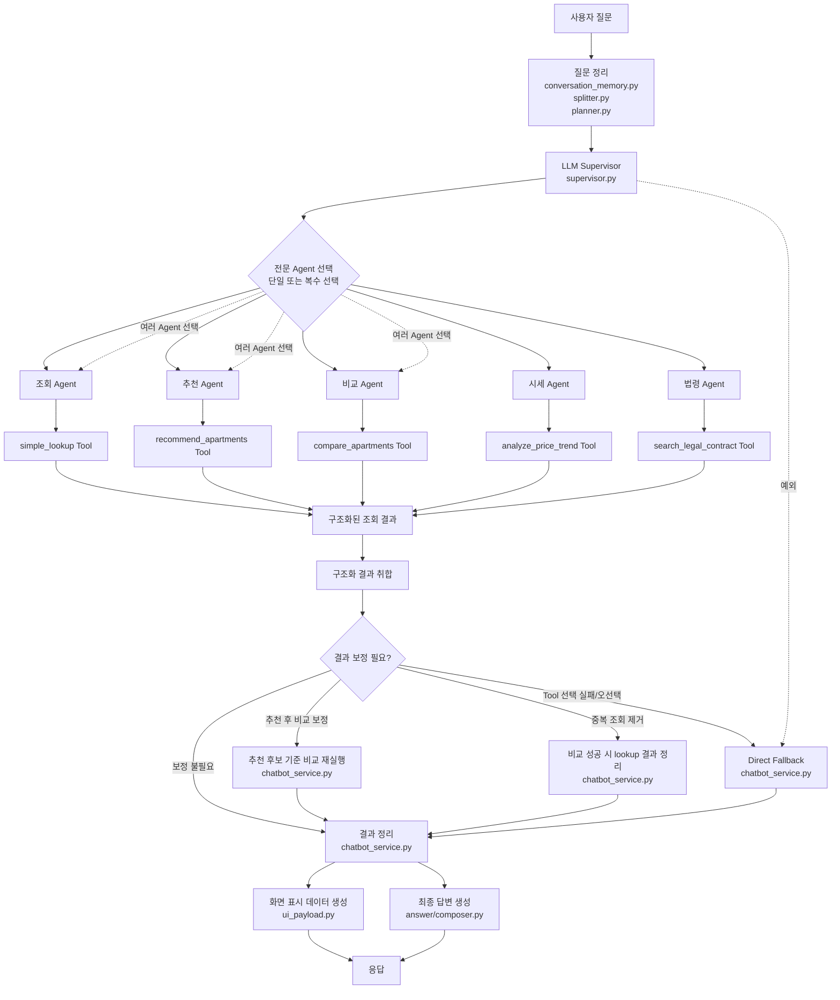

# LLM 기반 챗봇 처리 흐름

## 요약

- 기본 실행 흐름은 `LLM Supervisor -> 전문 Agent -> 전문 Tool` 구조다.
- 질문 정리 단계에서는 대화 맥락 정리, 질문 분리, task 단위 계획을 만든다.
- Supervisor는 질문에 따라 단일 Agent 또는 여러 Agent를 선택할 수 있다.
- Agent는 도메인별 Tool을 호출하고, Tool은 DB/RAG/service 결과를 구조화된 JSON으로 반환한다.
- `chatbot_service.py`는 추천 후 비교 보정, 중복 lookup 제거, direct fallback 같은 결과 정리를 담당한다.
- `ui_payload.py`는 화면 표시 데이터, `answer/composer.py`는 최종 답변 생성을 담당한다.
